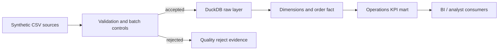

# Retail Operations Data Platform


**Data Engineering · Analytics Engineering · Retail Operations · Decision Support**

A production-minded analytics pipeline that converts synthetic retail orders into tested dimensional models and decision-ready inventory metrics.

[Quick start](#quick-start) · [Case study](docs/CASE_STUDY.md) · [Architecture](docs/ARCHITECTURE.md) · [Source](https://github.com/alianisreyesr/retail-operations-data-platform)

> **Data boundary:** Every customer, product, order, and location is fictional. This portfolio project contains no employer, payment, personal, or production data.

## Business outcome

Retail operations teams need one trustworthy view of revenue, demand, inventory pressure, and fulfillment performance. This project demonstrates how raw operational files become quality-checked analytical tables rather than an unreviewed dashboard export.

| Consumer | Decision supported |
|---|---|
| Operations manager | Which stores and products need attention? |
| Inventory planner | Which SKUs are below reorder level? |
| Finance analyst | What revenue and margin were generated? |
| Data team | Did source quality and reconciliation checks pass? |

## What it demonstrates

- Incremental-style ingestion with deterministic batch identifiers
- Explicit schema and domain validation before loading
- DuckDB raw, dimension, and fact tables
- Revenue, margin, fulfillment, and low-stock metrics
- Reject records with human-readable quality reasons
- Source-to-target reconciliation and automated tests
- Reproducible CLI execution and CI quality gates

## Architecture



See the [architecture notes](docs/ARCHITECTURE.md) for design decisions and production extensions.

## Quick start

```bash
python -m venv .venv
source .venv/bin/activate
python -m pip install -r requirements.txt
python -m retail_ops.pipeline --input data/orders.csv --database retail_ops.duckdb
python -m pytest
```

Expected pipeline summary:

```text
accepted=8 rejected=2 gross_revenue=1666.00 gross_margin=698.50
```

## Repository structure

```text
src/retail_ops/        pipeline and business rules
data/                  synthetic demonstration input
tests/                 unit and integration tests
docs/                  architecture and business case study
.github/                CI, CodeQL, Dependabot, issue templates
```

## Engineering boundary

This is a portfolio implementation, not a hosted production retail platform. Production use would require managed secrets, orchestration, object storage, access controls, observability, data contracts, recovery procedures, and environment-specific cost and performance testing.

## Target roles

Data Engineer · Analytics Engineer · BI Developer · Data Quality Engineer

---

Built by [Alianis Reyes-Reyes](https://www.linkedin.com/in/alianis-reyes-reyes/).
