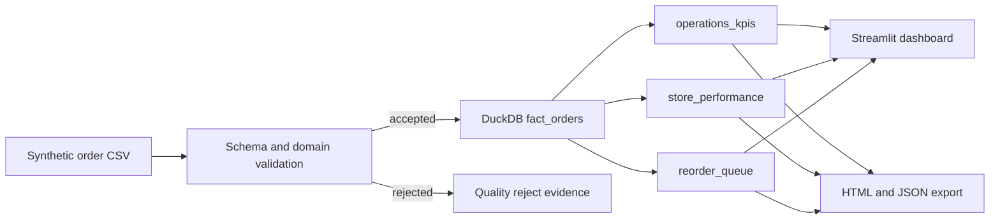
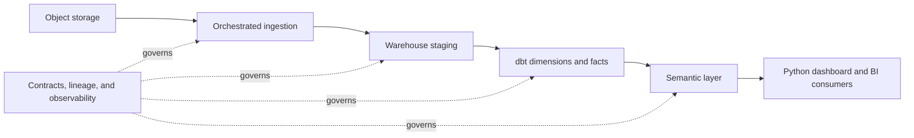

# Architecture decisions

## Why DuckDB

DuckDB provides a reproducible analytical engine without requiring a hosted database. The transformation SQL can later move to a warehouse-oriented implementation.

## Quality contract

Every row must provide the documented columns. Numeric domains reject negative or malformed operational values. Rejected rows retain the batch identifier, business key when available, and explicit reasons.

## Idempotency

The input SHA-256 prefix is the batch identifier. Reprocessing the same source replaces its reject evidence and rebuilds the demonstration fact model deterministically.

## Production evolution

